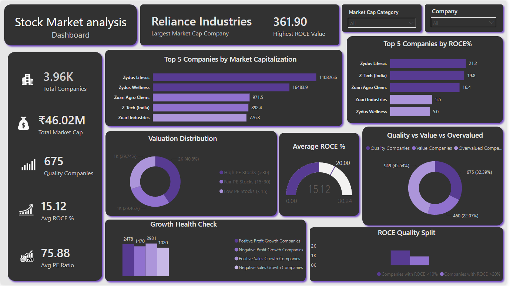

# Indian Stock Market Analytics Dashboard | Power BI Analytics

## 📊 Dashboard Preview

  

*Comprehensive Power BI dashboard analyzing Indian stock market trends, portfolio performance, and investment insights*

---

## 📋 Project Overview

This is an **Indian Stock Market Analytics Dashboard** built to analyze market trends, track stock performance, and provide investment insights. The dashboard enables investors and analysts to make data-driven investment decisions based on real-time market data.

### Key Objectives
- **Track market trends** across major Indian stock indices
- **Analyze stock performance** by sector and company
- **Monitor portfolio metrics** for better risk management
- **Identify investment opportunities** based on data-driven analysis
- **Visualize market patterns** for informed decision-making

---

## 🎯 Dashboard Features

### 1. **Market Overview**
- Major indices performance (Sensex, Nifty, Bank Nifty, etc.)
- Market breadth indicators
- Trading volume analysis
- Price trends and patterns

### 2. **Stock Performance Analysis**
- Individual stock metrics
- Sector-wise performance breakdown
- Price change tracking
- Top gainers and losers identification

### 3. **Portfolio Metrics**
- Portfolio value tracking
- Return on Investment (ROI) analysis
- Risk assessment metrics
- Diversification analysis

### 4. **Technical Indicators**
- Moving averages
- Volume trends
- Volatility analysis
- Support/Resistance levels

### 5. **Interactive Filters**
- Date range selection
- Sector filtering
- Stock selection
- Index comparison

---

## 📊 Key Metrics & Insights

| Metric | Purpose | Application |
|--------|---------|-------------|
| **Index Performance** | Track market movement | Gauge overall market health |
| **Stock Volatility** | Measure price fluctuation | Assess investment risk |
| **Trading Volume** | Analyze market participation | Identify momentum |
| **Sector Performance** | Compare sector trends | Sector-based investment |
| **P/E Ratio Analysis** | Valuation metrics | Stock selection |
| **Dividend Yield** | Income analysis | Income-focused investing |

---

## 🔍 Analysis Dimensions

### By Index
- **Nifty 50**: Blue-chip companies
- **Sensex (BSE 30)**: Premier index
- **Bank Nifty**: Banking sector
- **Nifty IT**: Information Technology
- **Nifty Pharma**: Pharmaceutical sector

### By Sector
- Information Technology
- Banking & Finance
- Pharmaceuticals
- Energy
- Consumer Goods
- Automobiles
- Real Estate

### By Performance Metrics
- Daily/Weekly/Monthly returns
- Year-to-date performance
- 52-week high/low
- Market capitalization
- Volume trends

---

## 💡 Investment Insights

### Market Analysis
- **Trend Identification**: Recognize bullish/bearish patterns
- **Momentum Analysis**: Identify momentum-based opportunities
- **Sector Rotation**: Track sector performance cycles
- **Risk Assessment**: Evaluate portfolio risk exposure

### Portfolio Optimization
- **Diversification**: Ensure balanced sector exposure
- **Asset Allocation**: Optimize stock distribution
- **Rebalancing Triggers**: Data-driven rebalancing points
- **Risk-Return Profile**: Monitor risk-adjusted returns

### Decision Support
- **Entry/Exit Signals**: Technical analysis-based signals
- **Valuation Metrics**: Compare P/E ratios across stocks
- **Dividend Analysis**: Track dividend-paying stocks
- **Performance Benchmarking**: Compare against indices

---

## 🛠️ Technology Stack

| Component | Technology | Purpose |
|-----------|-----------|---------|
| **Dashboard Tool** | Microsoft Power BI | Interactive visualization & reporting |
| **Data Source** | NSE/BSE Historical Data | Indian market data |
| **Calculations** | DAX Measures | Financial metrics & KPIs |
| **Visualization** | Power BI Charts | Interactive visual analytics |
| **Refresh Rate** | Daily | Market data updates |

---

## 📈 Data Specifications

- **Data Source**: NSE (National Stock Exchange) & BSE (Bombay Stock Exchange)
- **Coverage**: 50+ stocks from Nifty 50 & Sensex
- **Historical Period**: 1-5 years historical data
- **Update Frequency**: Daily market close data
- **Metrics**: 30+ financial and technical indicators

### Key Data Fields
- Stock Price (Open, High, Low, Close)
- Trading Volume
- Market Capitalization
- Dividend Information
- P/E Ratio
- Sector Classification
- Index Membership

---

---

---

## 📊 Key Analysis Capabilities

### Stock Selection
- Filter by sector (IT, Finance, Pharma, etc.)
- Search by company name
- Compare multiple stocks side-by-side
- Identify top performers

### Technical Analysis
- View moving average trends
- Analyze volume patterns
- Identify support/resistance
- Track price momentum

### Portfolio Management
- Track holdings performance
- Monitor allocation percentages
- Calculate total returns
- Analyze diversification

### Market Comparison
- Compare against benchmark indices
- View sector performance relative to market
- Identify under/overvalued segments
- Track market sentiment

---

## 💼 Use Cases

### For Individual Investors
- Monitor personal portfolio performance
- Research stocks before investing
- Track dividend income
- Analyze market trends

### For Financial Advisors
- Present portfolio analysis to clients
- Compare fund performance
- Identify investment opportunities
- Monitor risk exposure

### For Traders
- Identify short-term trading opportunities
- Track intraday trends
- Analyze volume patterns
- Monitor technical levels

### For Analysts
- Conduct sector analysis
- Track market movements
- Identify correlations
- Generate research reports

---

## 📋 Dashboard Sections Explained

### Section 1: Market Overview
- Top indices performance
- Market breadth (gainers vs losers)
- Volume trends
- Sentiment indicators

### Section 2: Index Deep-Dive
- Nifty 50 components
- Sensex constituents
- Sector-wise breakdown
- Top 10 holdings

### Section 3: Sector Analysis
- Sector performance comparison
- Sector volatility
- Leading stocks by sector
- Sector trends

### Section 4: Stock Details
- Individual stock metrics
- Price charts
- Volume analysis
- Technical indicators

### Section 5: Performance Metrics
- Return calculations (daily/weekly/monthly/YTD)
- Volatility metrics
- Risk-adjusted returns
- Benchmarking

---

## 🔐 Data Privacy & Compliance

- Dashboard uses publicly available market data
- No confidential information stored
- Suitable for educational and personal investment analysis
- Complies with NSE/BSE data usage terms
- Historical data sourced from reliable market databases

---

## 📈 Key Performance Indicators

### Market Health
- Market breadth ratio
- Advance/Decline index
- Volatility index (VIX)
- Market sentiment

### Stock Metrics
- P/E Ratio (valuation)
- Dividend Yield (income)
- Market Cap (size)
- Beta (volatility)

### Portfolio Metrics
- Total Return (%)
- Annualized Return
- Sharpe Ratio (risk-adjusted)
- Volatility (Standard Deviation)

---

## 💡 Investment Strategies Supported

### Value Investing
- Filter low P/E stocks
- Identify undervalued opportunities
- Track dividend stocks
- Long-term holding analysis

### Growth Investing
- Track high-growth sectors
- Monitor earnings trends
- Identify momentum stocks
- Volatility analysis

### Dividend Investing
- Filter by dividend yield
- Track dividend history
- Identify consistent dividend payers
- Income projection

### Sector Rotation
- Compare sector performance
- Identify rotation opportunities
- Track sector cycles
- Relative performance analysis

---

## 🎯 Future Enhancements

Planned improvements:
- [ ] Real-time data integration with NSE/BSE APIs
- [ ] Machine learning-based stock recommendations
- [ ] Portfolio optimization using correlation analysis
- [ ] Automated alert system for price targets
- [ ] Options trading analysis
- [ ] Risk scoring model
- [ ] Mobile app version

---

## 🎓 Educational Value

This project demonstrates:
- **Data Visualization**: Creating professional financial dashboards
- **Financial Analysis**: Stock market metrics and analysis
- **Business Intelligence**: Using Power BI for investment analysis
- **Market Knowledge**: Understanding Indian stock market
- **Decision Support**: Data-driven investment decisions

---

## 📜 License

This project is licensed under the **MIT License** - see [LICENSE](LICENSE) file for details.

---

## 🤝 Contributing

Contributions welcome! Please read [CONTRIBUTING.md](CONTRIBUTING.md) for guidelines.

### Ways to Contribute
- Add new stocks or indices
- Enhance visualizations
- Improve analysis features
- Fix bugs or issues
- Add documentation

---

## 📞 Contact & Support

For questions or feedback:
- GitHub Issues: [Report bugs or suggest features](https://github.com/YOUR-USERNAME/Indian-Stock-Market-Dashboard/issues)
- LinkedIn: [Your LinkedIn Profile]

---

## 🎉 Key Takeaways

✅ **Professional dashboard** for market analysis  
✅ **50+ stocks** from major Indian indices  
✅ **Real-time insights** for investment decisions  
✅ **Technical indicators** for trend analysis  
✅ **Portfolio tracking** capabilities  
✅ **Educational resource** for learning stock analysis  

---

## ⭐ Star This Repository

If you find this dashboard useful, please consider giving it a star! It helps others discover the project.

---

**Project Version**: 1.0 | **Last Updated**: September 2026 | **Status**: ✅ Production Ready

  Made with ❤️ for Indian stock market investors and analysts

  <a href="#top">⬆️ Back to Top</a>

